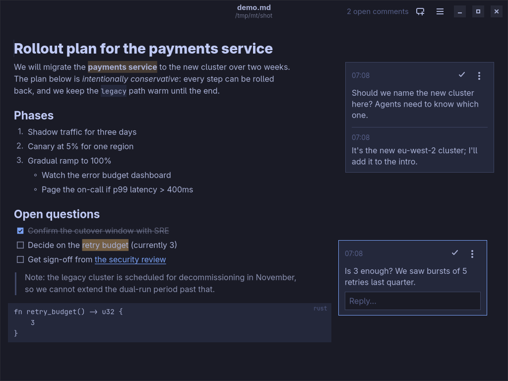

# Margin

A native Markdown editor for Omarchy where you leave Google Docs-style
comments that coding agents read and answer from the command line.



- **Markdown is an input mode.** Type `# ` and the line becomes a heading;
  type `**bold**` and you get bold. The syntax disappears; what stays on
  screen is a readable document in proportional type. The file on disk is
  plain Markdown, edited in place: text you did not touch is never
  rewritten, so diffs stay small.
- **Comments live in the right margin.** Select text and press
  <kbd>Ctrl</kbd>+<kbd>Alt</kbd>+<kbd>M</kbd>. Commented text is highlighted;
  clicking it focuses its card, and clicking a card highlights its text.
- **Agents use the `margin` CLI**, like `tuicr` and `hunk`: they list threads
  with file:line locations, read the document with threads inline, reply and
  resolve. Replies appear in the open editor as they arrive, and when an
  agent edits the document the editor updates and comments stay attached to
  their text.
- **Follows your Omarchy theme**, live, including light themes.

## Install

Needs Rust, GTK 4.20+ and libadwaita 1.8+ (all present on Omarchy).

```sh
./install.sh
```

This builds a release binary into `~/.local/bin/margin` and adds a launcher
entry and icon. To teach your coding agent the workflow, install the skill:

```sh
npx skills add tibbe/margin
```

## Writing

| Type | Get |
| --- | --- |
| `# `, `## ` … `###### ` at the start of a line | Heading |
| `- `, `* `, `1. `, `- [ ] ` | Bulleted, numbered or checklist item; Enter continues the list, Enter on an empty item leaves it, Tab/Shift+Tab nest |
| `> ` | Quote |
| ```` ``` ```` then Enter | Code block (closed for you) |
| `---` then Enter | Horizontal rule |
| `**bold**`, `*italic*`, `~~struck~~`, `` `code` ``, `[text](url)` | Inline formatting |

Enter starts a new paragraph; Shift+Enter breaks the line within one.
Backspace at the start of a heading, list item or quote turns it back into a
paragraph. Ctrl+click opens a link (links to other `.md` files open in
Margin). <kbd>Ctrl</kbd>+<kbd>/</kbd> shows the Markdown source;
<kbd>Ctrl</kbd>+<kbd>?</kbd> lists all shortcuts, which follow Google Docs
where it has one (Ctrl+B, Ctrl+Alt+1 for Heading 1, Ctrl+Shift+8 for bullets…).

Documents save themselves a moment after you stop typing. When another
program changes the file, Margin picks the change up; if you had unsaved
edits it merges them, and asks only when both touched the same lines.
<kbd>Ctrl</kbd>+<kbd>N</kbd> opens an untitled document, kept in
`~/.local/share/margin/drafts/` until you save it with
<kbd>Shift</kbd>+<kbd>Ctrl</kbd>+<kbd>S</kbd> (an empty one is discarded on
close; ones left by a crash reopen at the next launch). Closing or quitting
asks before throwing away text that is in no file: an untitled document, or
one whose save failed.

Find with <kbd>Ctrl</kbd>+<kbd>F</kbd> (matches the text as shown, so
"bold text" finds `**bold** text`), replace with
<kbd>Ctrl</kbd>+<kbd>H</kbd>. <kbd>Ctrl</kbd>+<kbd>+</kbd>/<kbd>-</kbd>/<kbd>0</kbd>
(or Ctrl+scroll) change the text size, <kbd>Ctrl</kbd>+<kbd>P</kbd> prints the
document as shown, <kbd>F11</kbd> is fullscreen and <kbd>F10</kbd> opens the
menu.

Paragraphs keep the file's line breaks on screen. If your files are
hard-wrapped, turn on *Reflow Paragraphs* (<kbd>Alt</kbd>+<kbd>Z</kbd>): line
breaks inside paragraphs then show as spaces, and the file keeps them. Settings
live in `~/.config/margin/settings.json`.

## Comments

Select text and press <kbd>Ctrl</kbd>+<kbd>Alt</kbd>+<kbd>M</kbd> (or click
the bubble that appears in the margin), write, and press
<kbd>Ctrl</kbd>+<kbd>Enter</kbd>. <kbd>Ctrl</kbd>+<kbd>Alt</kbd>+<kbd>↓</kbd>
and <kbd>↑</kbd> step through threads. Resolved threads hide until you turn on
*Show Resolved* in the menu. <kbd>Ctrl</kbd>+<kbd>Shift</kbd>+<kbd>C</kbd> copies
the open comments as a list with `file:line:column` spans, to paste
into a coding agent; *Resolve All* in the menu closes every open thread (with
Undo). Comments carry no author: one person comments, agents
reply.

Comments are stored outside the document, in
`~/.local/share/margin/docs/`, one JSON file per document.

## For agents

```text
margin comments [FILE…]      open threads, with file:line:column and the quoted text
margin reply FILE ID "…" [--resolve]
margin resolve FILE ID ["closing note"]
margin add FILE --quote "text" "question"
margin open FILE             show a document to the user (returns at once)
```

`comments` takes `--json`. `margin --help` has the rest. The
skill in [`skills/margin/SKILL.md`](skills/margin/SKILL.md) describes the
workflow for coding agents.

## Development

```sh
cargo test                     # Markdown analysis, editing semantics, store, anchors
cargo clippy --all-targets
```

The editor can be driven headlessly, which is how the UI is tested:

```sh
gtk4-broadwayd :7 &
GDK_BACKEND=broadway BROADWAY_DISPLAY=:7 MARGIN_DATA_DIR=/tmp/margin-test \
  MARGIN_SCRIPT=steps.txt margin doc.md
```

The script language (type text, press keys, add comments, take screenshots)
is documented at the top of [`crates/gtk/src/debug.rs`](crates/gtk/src/debug.rs).
`tools/run-ui-script.sh SCRIPT DOC` does the same with real mouse clicks and
key presses sent through the display, which is how anything the mouse does is
tested.

## License

MIT; see [`LICENSE`](LICENSE). Margin was written by Claude, in Claude Code,
directed by Johan Tibell.
